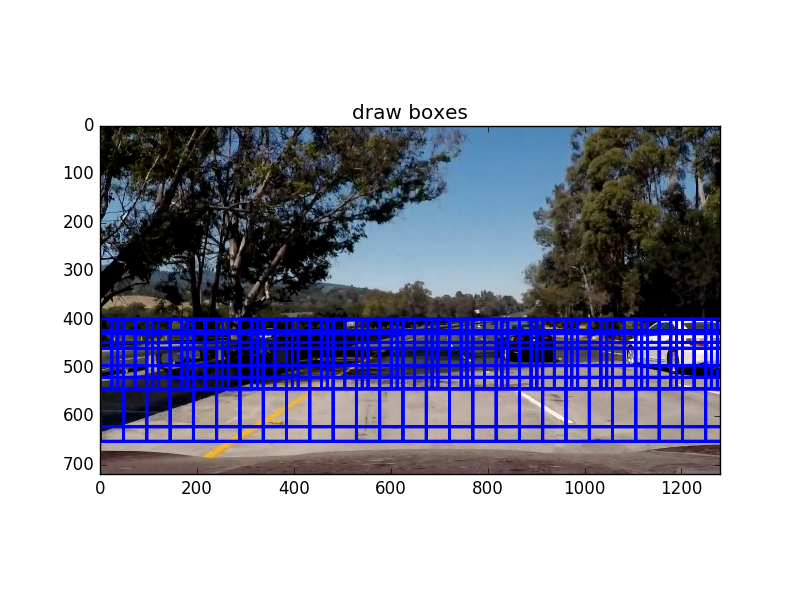
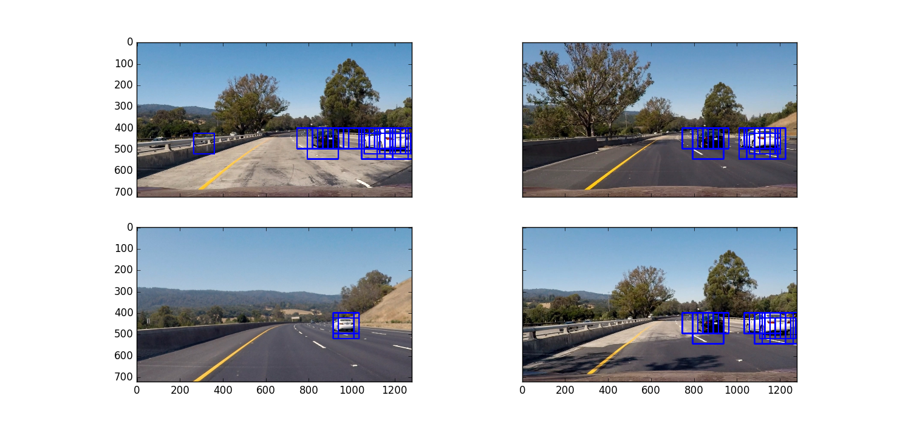
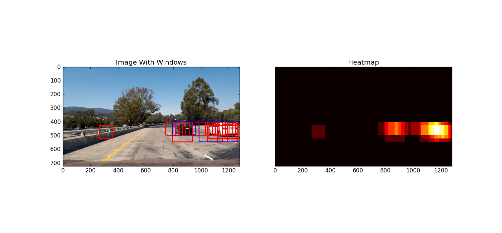
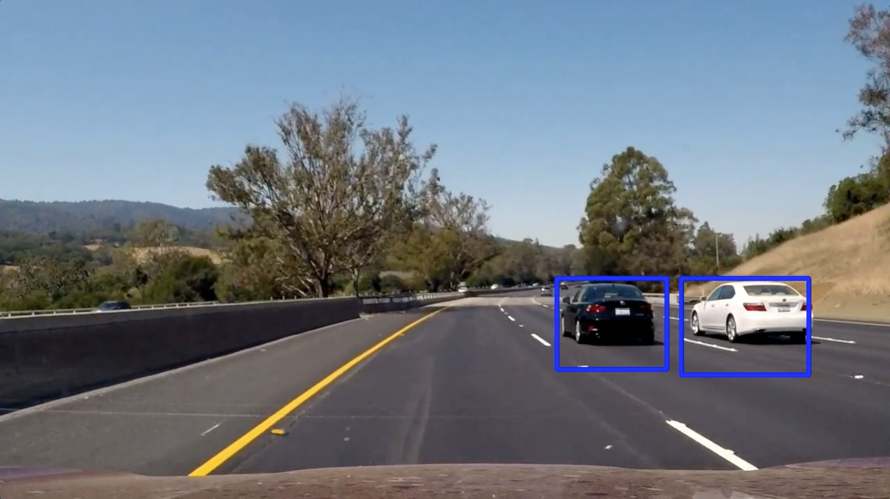

# Tracking Vehicles Using Machine Learning and Computer Vision
# Udacity Self-Driving Car Engineer Nanodegree

### By Wonjun Lee

---
## Overview

This is a machine learning and computer vision project from Udacity.

In this project, I developed a model that detects cars from a video stream and draw rectangles around the cars detected by the model.

The labeled data for vehicle and non-vehicle examples to train your classifier come from a combination of the [**GTI vehicle image database**](http://www.gti.ssr.upm.es/data/Vehicle_database.html), the [**KITTI vision benchmark suite**](http://www.cvlibs.net/datasets/kitti/), and examples extracted from the project video itself.

When training the model, **SVM (Support Vector Machine)** was used.

Below is the description of folders in the repository.

- **README.ipynb, README.md**: The documents you are reading now.
- **project-files folder**
    - **test_train_data.py**: The first thing to run for the project. This will extract features from data and create train and test data. Then it will build a machine learning model based on the data. Everything will be saved as **pickle** files.
    - **lesson_functions.py**: It contains all necessary functions including functions that extract features from images and functions that identify false positives.
    - **search_and_classify.py**: It takes few example images and draws boxes on cars based on the model's prediction.
    - **search_and_classify_video.py**: Same as the above except it will produce video data.
- **Lab folder**: It contains python scripts that I used for experiments.
- **images folder**: It contains **png** files that are used in this **README**.

---
## Creating Features

Features used for the model consist of a spatial binning, a color histogram, HOG (Historgram of Oriented Gradient).

I used **YCrCb** color space for the features. All the images were first converted to **YCrCb** from **RGB** color space.

### 1. Spatial Binning of Color

The first part of the feature is the raw pixel values of an image.
The image from training data is resized into **16 by 16** and converted into a vector using **ravel()**.

*cv2.resize()* function from **OpenCV** library is used to resize the image.

    # Define a function to compute binned color features  
    def bin_spatial(img, size=(32, 32)):
        # Use cv2.resize().ravel() to create the feature vector
        features = cv2.resize(img, size).ravel() 
        # Return the feature vector
        return features

### 2. Histograms of Color

We can detect a car by looking at its colors. Color of an image provides important information that can help us to distinguish a car from non-car.

**YCrCb** just like any other color spaces contains **3** color channels. Histograms of pixels from each channel are constructed with bin size equals 32.

    # Define a function to compute color histogram features 
    # NEED TO CHANGE bins_range if reading .png files with mpimg!
    def color_hist(img, nbins=32, bins_range=(0, 256)):
        # Compute the histogram of the color channels separately
        channel1_hist = np.histogram(img[:,:,0], bins=nbins, range=bins_range)
        channel2_hist = np.histogram(img[:,:,1], bins=nbins, range=bins_range)
        channel3_hist = np.histogram(img[:,:,2], bins=nbins, range=bins_range)
        # Concatenate the histograms into a single feature vector
        hist_features = np.concatenate((channel1_hist[0], channel2_hist[0], channel3_hist[0]))
        # Return the individual histograms, bin_centers and feature vector
        return hist_features


### 3. Histogram of Oriented Gradient (HOG)
A car can be distinguished from a non-car by looking at its edges. **HOG** will compute the gradients from blocks of cells. Then, a histogram is constructed with these gradient values.

I used **hog** function from **scikit-image**.

    # Define a function to return HOG features and visualization
    def get_hog_features(img, orient, pix_per_cell, cell_per_block, 
                            vis=False, feature_vec=True):
        # Call with two outputs if vis==True
        if vis == True:
            features, hog_image = hog(img, orientations=orient, 
                                      pixels_per_cell=(pix_per_cell, pix_per_cell),
                                      cells_per_block=(cell_per_block, cell_per_block), 
                                      transform_sqrt=True, 
                                      visualise=vis, feature_vector=feature_vec)
            return features, hog_image
        # Otherwise call with one output
        else:      
            features = hog(img, orientations=orient, 
                           pixels_per_cell=(pix_per_cell, pix_per_cell),
                           cells_per_block=(cell_per_block, cell_per_block), 
                           transform_sqrt=True, 
                           visualise=vis, feature_vector=feature_vec)
            return features

---
## Constucting A Model

After extracting features from all data, I used **SVM** to train the features.

Before training the data, the data was normalized using **StandardScaler()** from **sklearn.preprocessing**.

Then these normalized data were splitted into train and test sets.

    # Combining car and notcar features
    X = np.vstack((car_features, notcar_features)).astype(np.float64)                        
    # Fit a per-column scaler
    X_scaler = StandardScaler().fit(X)
    # Apply the scaler to X
    scaled_X = X_scaler.transform(X)

    # Define the labels vector
    y = np.hstack((np.ones(len(car_features)), np.zeros(len(notcar_features))))


    # Split up data into randomized training and test sets
    rand_state = np.random.randint(0, 100)
    X_train, X_test, y_train, y_test = train_test_split(
        scaled_X, y, test_size=0.2, random_state=rand_state)
        
    # Use a linear SVC 
    svc = LinearSVC(max_iter=20000)
    svc.fit(X_train, y_train)
   
### The Best Set of Parameters  
After repeating this procedure many times with different sets of parameters, I found the set of parameters below worked the best.

- **Spatial Binning of Color**: size = (16, 16)
- **Histograms of Color**: nbins = 32
- **Histogram of Oriented Gradient (HOG)**: orient = 8, pix_per_cell = 8, cell_per_block = 2

---
## Sliding Window Search

Below is the set of windows that I used to detect the cars from video stream. Small windows are located at the center and as the size of windows gets larger, they become closer to the bottom of the image.



### Code for Sliding Window Search
    # Define a function that takes an image,
    # start and stop positions in both x and y, 
    # window size (x and y dimensions),  
    # and overlap fraction (for both x and y)
    def slide_window(img, x_start_stop=[None, None], y_start_stop=[None, None], 
                        xy_window=(64, 64), xy_overlap=(0.5, 0.5)):
        # If x and/or y start/stop positions not defined, set to image size
        if x_start_stop[0] == None:
            x_start_stop[0] = 0
        if x_start_stop[1] == None:
            x_start_stop[1] = img.shape[1]
        if y_start_stop[0] == None:
            y_start_stop[0] = 0
        if y_start_stop[1] == None:
            y_start_stop[1] = img.shape[0]
        # Compute the span of the region to be searched    
        xspan = x_start_stop[1] - x_start_stop[0]
        yspan = y_start_stop[1] - y_start_stop[0]
        # Compute the number of pixels per step in x/y
        nx_pix_per_step = np.int(xy_window[0]*(1 - xy_overlap[0]))
        ny_pix_per_step = np.int(xy_window[1]*(1 - xy_overlap[1]))
        # Compute the number of windows in x/y
        nx_windows = np.int(xspan/nx_pix_per_step) - 1
        ny_windows = np.int(yspan/ny_pix_per_step) - 1
        # Initialize a list to append window positions to
        window_list = []
        # Loop through finding x and y window positions
        # Note: you could vectorize this step, but in practice
        # you'll be considering windows one by one with your
        # classifier, so looping makes sense
        for ys in range(ny_windows):
            for xs in range(nx_windows):
                # Calculate window position
                startx = xs*nx_pix_per_step + x_start_stop[0]
                endx = startx + xy_window[0]
                starty = ys*ny_pix_per_step + y_start_stop[0]
                endy = starty + xy_window[1]

                # Append window position to list
                window_list.append(((startx, starty), (endx, endy)))
        # Return the list of windows
        return window_list

### Using the function to construct windows
    windows = slide_window(image, x_start_stop=[None, None], y_start_stop=[400, 500], 
                        xy_window=(96, 96), xy_overlap=(0.75, 0.75))
    windows += slide_window(image, x_start_stop=[None, None], y_start_stop=[400, 500], 
                        xy_window=(144, 144), xy_overlap=(0.75, 0.75))
    windows += slide_window(image, x_start_stop=[None, None], y_start_stop=[430, 550], 
                        xy_window=(192, 192), xy_overlap=(0.75, 0.75))
    windows += slide_window(image, x_start_stop=[None, None], y_start_stop=[460, 580], 
                        xy_window=(192, 192), xy_overlap=(0.75, 0.75))


## Detecting Cars From An Image

The model predicts a label (car or notcar) from an image inside each window. If a car is detected, then a rectangle is drawn. Below are example images with boxes drawn by the model.



### Combining Windows With A Heatmap
When a car is detected, multiple boxes are drawn on the car, so I used a **heatmap** to combine boxes into a single box.

**create_heatmap** function will convert windows into a heatmap.
    # Convert windows to heatmap numpy array.
    def create_heatmap(windows, image_shape):
        background = np.zeros(image_shape[:2])
        for window in windows:
            background[window[0][1]:window[1][1], window[0][0]:window[1][0]] += 1
        return background

After the heatmap is created, windows are constructed arond the continuous nonzero areas. I found that those pixels are usually **false positives**.

    # find the nonzero areas from a heatmap and
    # turn them to windows
    def find_windows_from_heatmap(image):
        hot_windows = []
        # Set labels
        labels = ndi.label(image)
        # iterate through labels and find windows
        for car_number in range(1, labels[1]+1):
            # Find pixels with each car_number label value
            nonzero = (labels[0] == car_number).nonzero()
            # Identify x and y values of those pixels
            nonzeroy = np.array(nonzero[0])
            nonzerox = np.array(nonzero[1])
            # Define a bounding box based on min/max x and y
            bbox = ((np.min(nonzerox), np.min(nonzeroy)), (np.max(nonzerox), np.max(nonzeroy)))
            hot_windows.append(bbox)
        return hot_windows, labels[0]

**ndi.label** will find nonzero areas and label them starting from 1 and set the background as 0.

More details about a **label** function can be found [here](https://docs.scipy.org/doc/scipy-0.16.0/reference/generated/scipy.ndimage.measurements.label.html).

Below are example images. Blue boxes are combined boxes.



---
## Video Implementation

The overall performance of the model is pretty nice; however, there are some cases when the model does not detect the car from an image, which results in no boxes drawn on the image. I implemented an algorithm that uses the windows data from previous frames to predict the location of the windows if the model fails to draw rectangles on cars.

The class Window contains an array **probability**. This array is initialized by **initialize_center_box** function.
    # Define a class to receive the characteristics of each line detection
    class Window():
        def __init__(self):
            self.probability = []

    # Create an array for the center and the radius of the boxes
    def initialize_center_box(boxes):
        result = []
        for box in boxes:
            center = find_center(box)
            width, height = find_radius(box)
            move = (0, 0) # movement of an object
            result.append((center, width, height, move, 1))
        return result

Each item in the array contains 5 values.
1. center: x and y coordinates of a center of a box
2. width: A width of a box
3. height: A height of a box
4. move: Changes in x values and y values of a center of a box
5. prob: This is the confidence level of the box. If the value is high then it will be likely that the box should be drawn even though the model doesn't detect anything in that area.

Then **average_boxes** function is used to compare new windows from current frame and old windows from previous frames. If only the boxes with high confidence value wil be drawn. In this project, I used confidence level equals 2.

    # Compare the new boxes with boxes from previous frames.
    def average_boxes(hot_windows, old_boxes, image_shape):
        # initialize a center box array
        hot_boxes = initialize_center_box(hot_windows)
        # Add the new center box array to the old center box
        new_boxes = add_center_box(hot_boxes, old_boxes)
        filtered_boxes = []
        for new_box in new_boxes:
            # Draw boxes only if the confidence level is above 2
            if new_box[-1] > 2:
                filtered_boxes.append(new_box)
        new_windows = []
        # convert center-width-height to lefttop-rightbottom format
        for filtered_box in filtered_boxes:
            new_center, new_width, new_height,new_move, new_prob = filtered_box
            new_windows.append(((int(new_center[0]-new_width), int(new_center[1]-new_height)), 
                (int(new_center[0]+new_width), int(new_center[1]+new_height))))
        # Create a heatmap
        heatmap = create_heatmap(new_windows, image_shape)
        # Check if there is any overlap of windows
        # If there is then delete the pixels around the overlap.
        if np.unique(heatmap)[-1] >= 2:
            labels = ndi.label(heatmap)[0]
            heatmap_2 = np.zeros_like(heatmap)
            heatmap_2[heatmap>=2] = 1
            labels_2 = ndi.label(heatmap_2)
            array_2 = np.argwhere(labels_2[0])
            for car_number in range(1, labels_2[1]+1):
                # Find pixels with each car_number label value
                nonzero = (labels_2[0] == car_number).nonzero()
                # Identify x and y values of those pixels
                num = labels[nonzero[0][0], nonzero[1][0]]
                labels[labels == num] = 0
            heatmap = labels + heatmap_2
            new_windows = find_windows_from_heatmap(heatmap)
        # return the boxes with high confidence and new set of probability array
        return new_windows, new_boxes

---
## Result

Here's a [link](https://www.youtube.com/watch?v=dQvC2SWOD5U) to my video result



---
## Discussion

1. **Briefly discuss any problems / issues you faced in your implementation of this project. Where will your pipeline likely fail? What could you do to make it more robust?**

The video that I used for the project shows clear distinguishment between cars and a road. If the video contains multiple non car objects such as pedestrians, then the model will likely detect them as cars. The model will also fail if the video contains a lot of noise pixels. To improve the model, I will have to increase the size of training data for model to distinguish cars from non car objects more confidently.

I will work on improving **average_boxes** function and **find_windows_from_heatmap**. The model doesn't separate two cars very well when they are close together. After this, I will combine this pipeline with the pipeline from a previous project that detects lanes.


```python

```
